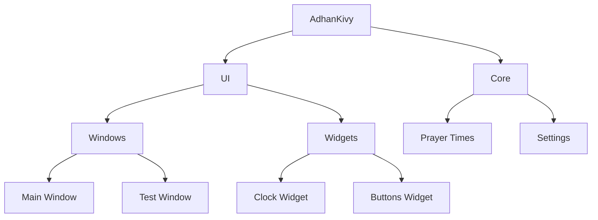

# AdhanKivy Wiki

Welcome to the AdhanKivy Wiki! Here you will find documentation on the development and use of the application.

## Wiki Structure

1. **Development** - technical documentation for developers
2. **Installation and Usage** - installation and setup instructions

## Contents

### Development

#### Architecture (Application Structure)

#### Configuration

* [Double Tap Settings](double_tap_settings "Double tap handling implemented in application windows")

### Installation and Usage

## File Naming Rules

- We use only English letters in file names
- We use underscores (_) instead of spaces

----

# AdhanKivy Wiki

AdhanKivy Wiki'ye hoş geldiniz! Burada uygulamanın geliştirilmesi ve kullanımı hakkında belgeler bulacaksınız.

## Wiki Yapısı

1. **Geliştirme** - geliştiriciler için teknik belgeler
2. **Kurulum ve Kullanım** - kurulum ve ayar talimatları

## İçerik

### Geliştirme

#### Mimari (Uygulama Yapısı)

#### Yapılandırma

* [Çift Dokunma Ayarları](double_tap_settings "Uygulama pencerelerinde çift dokunma işlemi uygulandı")

### Kurulum ve Kullanım

## Dosya Adlandırma Kuralları

- Dosya adlarında sadece İngilizce harfler kullanırız
- Boşluk yerine alt çizgi (_) kullanırız

----

# AdhanKivy Wiki

Добро пожаловать в Wiki проекта AdhanKivy! Здесь вы найдете документацию по разработке и использованию приложения.

## Структура Wiki

1. **Разработка** - техническая документация для разработчиков
2. **Установка и Использование** - инструкции по установке и настройке

## Содержание

### Разработка

#### Архитектура (Структура приложения)

#### Конфигурация

* [Настройка двойного касания](double_tap_settings "Реализована обработка двойного касания в окнах приложения")

### Установка и Использование

## Правила именования файлов

- Используем только английские буквы в названиях файлов
- Используем нижнее подчеркивание (_) вместо пробелов
